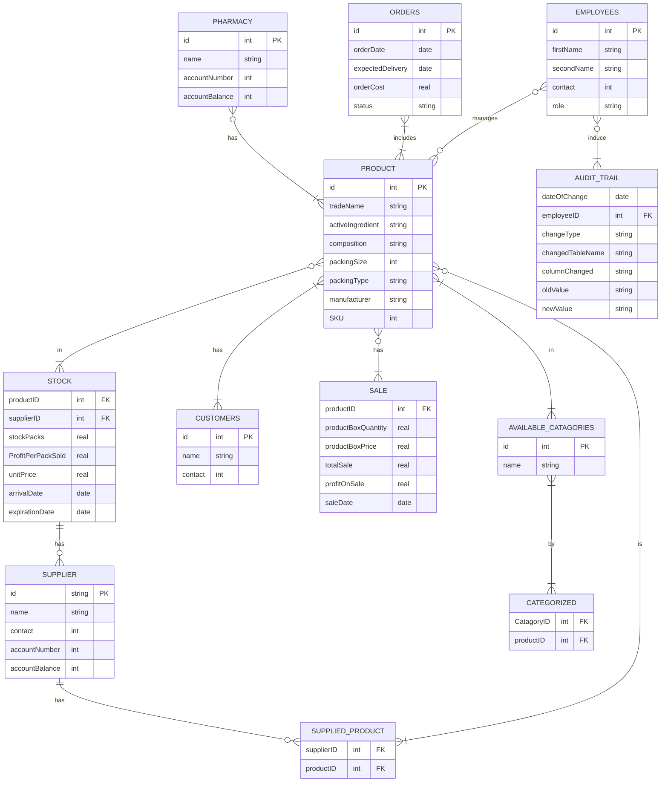

# Design Document

By Muhammad Saad Masood

Video overview: (Normally there would be a URL here, but not for this sample assignment!)

## Scope

The database for Pharmacy includes all entities necessary to facilitate the process of tracking orders, recording the sales, customer, supplier, product information. As such, included in the database's scope is:

* Product including the necessary product details.
* Supplier information for contacting and updating the stocks.
* Stock of the available products where the stock is maintained,
their arrival date and expiration date is kept.
* Sales information of each product. How much revenue each product is generating and the contribution of each product in
the overall profit and sale.
* Audit trail is also included to recored who made the changes and to which table's column along with the old and new values.
* Transactions are also included which happen when an order is completed between the supplier and the pharmacy.

Out of scope are elements like user authentication, transaction
rollback, complete audit report.

## Functional Requirements

This database will support:

* CRUD operations for pharmacy, product, sale, orders, supplier etc.
* Transaction between the supplier and the pharmacy when the orders are completed.
* Recording sales data of each product based on their composition, packing size etc.
* Updating the stocks based on each sale of the specific product.
* All the changes made to the sales and the stocks are recoreded along the employeee who made those changes for keeping the record.

Note that in this database you will not be able to roll back transactions and also the stock can go below zero since there is no check statement for stock.

## Representation

Entities are captured in SQLite tables with the following schema.

### Entities

The database includes the following entities:

#### Pharmacy

The `pharmacy` table includes:

* `id`, which specifies the unique ID for the pharmacy as an `INTEGER`. This column thus has the `PRIMARY KEY` constraint applied.
* `name`, which specifies the pharmacy's name as `TEXT`, given `TEXT` is appropriate for name fields.
* `account_number`, which specifies the pharmacy's bank account number. Its and `INTEGER` since account numbers are usually integars. It also cannot be null since the transactions have to take place between the pharmacy and the supplier.
* `account_balance`, which specifies pharmacy's balance as `INTEGER` and can also not be null.

#### Product

The `Product` table includes:

* `id`, which specifies the unique ID for the product as an `INTEGER`. This column thus has the `PRIMARY KEY` constraint applied.
* `trade_name`, which specifies the product's trade name as `TEXT`.
* `active_ingredient`, which specifies the product's active ingredient as `TEXT`.
* `composition` which specifies the products composition/ concentration as `TEXT`.
* `packing_size` shows the quantity of product present in one box and is `INTEGER` in nature.
* `packing_type` tell if the product is either a tabler, capsule or injectable and is shown as `TEXT`.
* `manufacturer` shows who made the product and is shown as `TEXT`.
* `SKU` which is the unique product identification number used when the product is dispatched to keep the track of the order.
Its represented with `INTEGER`.

All columns in the `product` table are required and hence should have the `NOT NULL` constraint applied. No other constraints are necessary.

#### Stock

The `stock` table includes:

* `product_id`, which specifies the product's unique ID as an `INTEGER`. This column has the `FOREIGN KEY` constraint referencing the `id` column in the `product` table.
* `supplier_id`, which specifies the supplier's unique ID as an `INTEGER`. This column has the `FOREIGN KEY` constraint referencing the `id` column in the `supplier` table.
* `stock_packs`, which shows the quantity of stock packs as `NUMERIC(10,2)` with the `NOT NULL` constraint.
* `profit_per_pack_sold`, which specifies the profit per pack sold as `NUMERIC(10,2)` with the `NOT NULL` constraint.
* `box_price_on_arrival`, which specifies the box price on arrival as `NUMERIC(10,2)` with the `NOT NULL` constraint.
* `unit_price_on_arrival`, which specifies the unit price on arrival as `NUMERIC(10,2)` with the `NOT NULL` constraint.
* `arrival_date`, which represents the date of arrival as `DATETIME` and the default value for this is `CURRENT_TIMESTAMP`.
* `expiration_date`, which represents the expiration date as `DATETIME` with the `NOT NULL` constraint and a default value of the current timestamp.

The `stock` table has the necessary `FOREIGN KEY` constraints referencing the `product` and `supplier` tables.

#### Supplied Product

The `supplied_product` table is designed to establish a relationship between suppliers and products. It includes the following columns:

* `supplier_id`: This is the supplier's id and shows this supplier supplied which products.

* `product_id`: This is the product_id of the products supplied by
the supplier.

the `supplied_product` table takes them as `FORIEGN KEYS`.

#### Orders

The `orders` table includes:

* `id`, which specifies the unique ID for the order as an `INTEGER`. This column thus has the `PRIMARY KEY` constraint applied.
* `order_cost`, which specifies the cost of the order as an `INTEGER`. This column is marked as `NOT NULL` to ensure the cost is always provided.
* `order_date`, which is the date the order was placed, represented as `DATETIME`. This column is marked as `NOT NULL` and defaults to the current timestamp when a new row is inserted.
* `delivery_date`, which is the expected delivery date for the order, represented as `DATETIME`. This column is marked as `NOT NULL` and defaults to the current timestamp when a new row is inserted.
* `status`, which represents the status of the order, and is of type `TEXT` with a default value of "incomplete".

#### Customers

The `customers` table includes:

* `id`, which specifies the unique ID for the customer as an `INTEGER`. This column thus has the `PRIMARY KEY` constraint applied.
* `name`, which specifies the name of the customer as `TEXT`. This column is marked as `NOT NULL` to ensure the name is always provided.
* `contact`, which is the contact information for the customer as an `INTEGER`.

The `id` column has the `PRIMARY KEY` constraint to ensure its uniqueness.

#### Sale

The `sale` table includes:

* `product_id`, which specifies the unique ID of the product being sold as an `INTEGER`. This column has the `FOREIGN KEY`.
* `product_box_quantity`, which represents the quantity of product boxes sold and is of type `NUMERIC(10,2)`. This column is marked as `NOT NULL`.
* `product_box_price`, which represents the price per product box and is of type `NUMERIC(10,2)`. This column is marked as `NOT NULL`.
* `total_sale`, which represents the total sale amount and is of type `NUMERIC(10,2)`. This column is marked as `NOT NULL`.
* `profit_on_sale`, which represents the profit earned on the sale and is of type `NUMERIC(10,2)`.
* `sale_date`, which represents the date of the sale and is of type `DATETIME`. This column is marked as `NOT NULL` with a default value of the current timestamp.

The `product_id` column has the `FOREIGN KEY` constraint to ensure it corresponds to a valid product in the `product` table.

#### Available Categories

The `available_categories` table includes:

* `id`, which specifies the unique ID for the category as an `INTEGER`. This column has the `PRIMARY KEY` constraint applied.
* `name`, which specifies the name of the category as `TEXT`. This column is marked as `NOT NULL`.

#### Categorized

The `categorized` table includes:

* `category_id`, This column speicfies the catagory id which is taken from the available catagories table.
* `product_id`, This table specifies the unique id of the product and assigns a catagory to it.

The catagorized table takes both the column as `FOREIGN KEYS`.

#### Employees

The `employees` table includes:

* `id`, which specifies the unique ID for the employee as an `INTEGER`. This column thus has the `PRIMARY KEY` constraint applied.
* `first_name`, which specifies the employee's first name as `TEXT`.
* `last_name`, which specifies the employee's last name as `TEXT`.
* `contact`, which specifies the employee's contact number as `INTEGER`.
* `role`, which specifies the employee's role as `TEXT`. The purpose of role was to give specific access to the employees. But SQLite users can access the whole database.

#### Audit Trial

The `audit_trial` table includes:

* `employee_id`, which specifies the unique ID of the employee associated with the audit trail as an `INTEGER`.
* `date_of_change`, which specifies the date and time of the change in the audit trail as `DATETIME`. This column has the `NOT NULL` constraint and defaults to the current timestamp when a new row is inserted.
* `change_type`, which specifies the type of change made, represented as `TEXT`. The change type can be `INSET`, `UPDATE`, `DELETE` etc.
* `changed_table_name`, which specifies the name of the table where the change occurred as `TEXT`.
* `changed_column_name`, which specifies the name of the column that was changed as `TEXT`.
* `old_value`, which represents the previous value before the change as `NUMERIC(10,2)`.
* `new_value`, which represents the new value after the change as `NUMERIC(10,2)`.

### Relationships

The below entity relationship diagram describes the relationships among the entities in the database.

As detailed by the diagram:

* A pharmacy can have many many products while the product can be in a pharmacy or it might be in the warehouse meaning not in the pharmacy so 0 to many relationship with pharmacy.
* A product can have 0 to many orders and the same goes for the orders where for an order to be counted as one it must have at least one product and as much as many products.
* A product can be managed by multiple employees or some other person or it is not managed by someone at all. Similarly an employee can manage multiple products or no product at all. This established a 0 to many relationship between them.
* An audit trail is induced by at least one employee because for a change to take place there must an an employee behind it so 1 to many relation exists. In the same way the employee can induce multiple changes or no changes at all i.e a 0 to many relation.
* A stock must have one product to be called it a stock can have upto multiple products, 1 to many relation. While the product might not be present in the stock or can be in multiple stocks, 0 to many relation.
* A customer is made when at least one product is bought. A customer can also but many products. Similarly, a products is made for the customer. It must have at least 1 customer to be called a product. The relationship between both of them is 1 to many relation.
* A supplier can have no stock of the product at all or can have multiple stocks of many products i.e 0 to many relation. Meanwhile a stock has one and only one supplier. multiple suppliers cannot sell the same stocks, a 1 to 1 relation
* For a sale to be counted at least one product must be sold and a sale can have multiple products so 1 to many relation. While a product can not be no sale or many sales, this 0 to many relationship.
* A product can have multiple catagories and for a catagory to be defined it must have at least one product. The relationship is 1 to many between them both.

## Optimizations

Per the typical queries in `queries.sql`, it is common for cashier to see the product details like product name, id, composition,
packing size so the index has been created on the products table including these column as these are the most frequent queries.

Similarly, the cashier also looks at the stock of the product, its box price , unit price, its expiration date. Thus index has been created for the stock table.

## Limitations

The projects limitaions includes there is no roll back for the transaction that violates the database rule / transaction rules.
All the user have the same access to the database irrespective of their roles sincle user authentication is not a feature of SQLite.
The stocks can go below zero if the sales are added without any considersation of the stock packs in the inventory since there is no condition applied when the stock is being updated.
